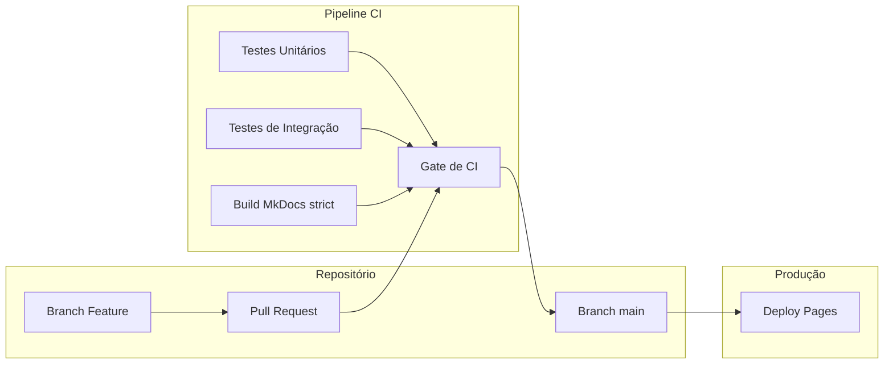

# Testes Automatizados e Integração Contínua (CI/CD)

Nesta aula, vamos explorar a evolução do desenvolvimento de software e entender como práticas modernas como Integração Contínua, Entrega Contínua e uma boa arquitetura de testes podem garantir entregas mais rápidas e com menos riscos.

>
> **Projeto:** Repositório com o código e testes automatizados e exemplos de CI/CD em <a href="https://github.com/i-davies/IEC-Testes-Automatizados" target="_blank" rel="noopener noreferrer">GitHub</a>.
---

## Slides

<div style="position: relative; width: 100%; height: 0; padding-top: 56.2500%;
 padding-bottom: 0; box-shadow: 0 2px 8px 0 rgba(63,69,81,0.16); margin-top: 1.6em; margin-bottom: 0.9em; overflow: hidden;
 border-radius: 8px; will-change: transform;">
  <iframe loading="lazy" style="position: absolute; width: 100%; height: 100%; top: 0; left: 0; border: none; padding: 0;margin: 0;"
    src="https://www.canva.com/design/DAHLpRxu7jw/YuNvvueqvhpfgf_3DXLrdQ/view?embed" allowfullscreen="allowfullscreen" allow="fullscreen">
  </iframe>
</div>
<a href="https:&#x2F;&#x2F;www.canva.com&#x2F;design&#x2F;DAHLpRxu7jw&#x2F;YuNvvueqvhpfgf_3DXLrdQ&#x2F;view?utm_content=DAHLpRxu7jw&amp;utm_campaign=designshare&amp;utm_medium=embeds&amp;utm_source=link" target="_blank" rel="noopener">Testes automatizados</a> de Icaro Davies

## A Evolução do Desenvolvimento

!!! info "Objetivos"
- Diferenciar os modelos de desenvolvimento Cascata e Ágil.
- Entender o pipeline de CI/CD e as responsabilidades de cada etapa.
- Compreender a Pirâmide de Testes e aplicar a estratégia correta para cada contexto.

!!! abstract "Conceitos-chave"
- **Modelo Cascata:** Baseado em etapas lineares, rígidas e irreversíveis, onde o feedback do cliente ocorre apenas no final do processo.
- **Modelo Ágil:** Foca em um processo iterativo e incremental, com ciclos curtos (Sprints), permitindo responder rapidamente a mudanças e promovendo colaboração contínua com entregas frequentes.

O cenário atual do desenvolvimento exige lidar com complexidade crescente e pressão por velocidade, sem abrir mão da qualidade e estabilidade. O modelo Ágil nos ajudou a encurtar o feedback, mas para acompanhar essa velocidade técnica, precisamos automatizar nosso fluxo.

---

## Entendendo o Pipeline CI/CD

Para lidar com a pressão de entregas constantes com integridade a cada alteração, estruturamos pipelines automatizados. Podemos fazer um paralelo simples do fluxo de software com a operação de um restaurante:

1. 
**Integração Contínua (CI):** Foca em integrar frequentemente e testar automaticamente. Envolve um repositório centralizado e automação de compilação. A saída é um código integrado e validado. *(Analogia do restaurante: a cozinha recebe o pedido, prepara e o chef prova para garantir a qualidade padrão, certificando que está pronto)*.


2. 
**Entrega Contínua (Continuous Delivery - CD):** O software fica sempre pronto para o deploy. Requer ambientes automatizados e testes mais abrangentes (regressão, aceite). A saída é a capacidade de realizar um deploy manual em *staging* ou produção a qualquer momento. *(Analogia do restaurante: o prato perfeito fica na bancada, esperando o garçom ter a ação manual de retirá-lo e levar à mesa).*


3. **Implantação Contínua (Continuous Deployment - CD):** Vai um passo além. Foca na implantação automática, sem intervenção manual, assim que passa pelo fluxo anterior. É caracterizado pelo uso de monitoramento profundo (Grafana, Prometheus) e estratégias como Blue/Green ou Canary. A saída é a entrega imediata em produção. *(Analogia do restaurante: uma esteira rolante automatizada que leva o prato da cozinha direto para a mesa do cliente no momento que fica pronto).*


---

## A Pirâmide de Testes

Para garantir o sucesso do nosso fluxo de CI/CD, os testes são cruciais. A pirâmide divide os testes equilibrando **Velocidade/Esforço** versus **Confiança/Custo**.

<div class="test-pyramid" role="img" aria-label="Pirâmide de testes com três camadas: UI E2E no topo, Integração no meio e Unitário na base">
    <div class="test-pyramid__layer test-pyramid__layer--top">
        <strong>UI / E2E (Topo)</strong>
        Jornada completa no navegador. Maior custo e manutenção.
    </div>
    <div class="test-pyramid__layer test-pyramid__layer--middle">
        <strong>Integração (Meio)</strong>
        Módulos trabalhando juntos, com confiança no fluxo e segurança para refatorar.
    </div>
    <div class="test-pyramid__layer test-pyramid__layer--base">
        <strong>Unitário (Base)</strong>
        Peça isolada, execução muito rápida, documentação viva e rede de segurança.
    </div>
</div>

- **Unitário (base):** foca em uma única peça de forma isolada. É extremamente rápido e funciona como documentação viva.
- **Integração (meio):** valida a comunicação entre módulos (por exemplo: Controller, Service e Banco de Dados).
- **UI / E2E (topo):** testa o sistema como o usuário final utiliza, com maior custo e tempo de execução.

??? tip "Trade-offs na Pirâmide"
    Quanto mais baixo na pirâmide, mais rápidos e baratos são os testes. Quanto mais alto, maior a confiança e cobertura sistêmica, porém aumentam o custo, o esforço e a lentidão na execução.

---

## Exemplo Prático com Python (Pytest)

Com base na nossa arquitetura, veja a diferença entre um teste unitário isolado e um teste de integração focado na comunicação web.

```python
import pytest
import time

# 1. TESTE UNITÁRIO
# Rápido, direto, ignora a web ou o banco de dados.
@pytest.mark.unit
def test_xp_resposta_rapida():
    # Valida apenas a regra de negócio isolada
    assert calcular_xp(3.0) == 100

# 2. TESTE DE INTEGRAÇÃO
# Testa múltiplas peças trabalhando juntas via client HTTP.
@pytest.mark.integration
def test_resposta_correta_ganha_xp(client):
    response = client.post("/responder", data={
        "resposta": "4",
        "desafio_id": 1,
        "timestamp": str(time.time()),
    })
    
    assert response.status_code == 200
    assert "Correta" in response.text
    assert "XP" in response.text

```

---

## Onde o CI atua (Merge Gate)

O CI funciona como um **portão de qualidade** entre o Pull Request e a branch `main`.

- O novo código nasce na `feature`.
- A mudança sobe por meio de um `Pull Request`.
- O **Gate de CI** executa testes automatizados e build.
- Só depois de aprovado, o merge segue para `main` e então para produção.



!!! tip "Leitura rapida do Gate"
    Se os testes falharem, o portão não abre e o merge é bloqueado. Se os testes passarem, o merge é liberado com mais segurança.


---


## Quiz de revisão

> Teste seus conhecimentos sobre os conceitos de engenharia de software e testes discutidos na aula.

<quiz>
No Modelo Cascata, a principal característica é:

* [x] Etapas lineares, sequenciais, rígidas e irreversíveis, com feedback apenas no final do ciclo.
* [ ] Divisão em ciclos curtos e melhoria contínua a cada iteração.
* [ ] Entrega frequente de software funcional ao longo de todas as etapas.
</quiz>

<quiz>
A Integração Contínua (CI) tem como foco principal:

* [ ] Realizar o deploy manual do código no servidor de produção.
* [ ] Estratégias de liberação Canary e monitoramento profundo com Grafana.
* [x] Integrar frequentemente o código em um repositório central, com build automatizado e validação de testes unitários.
</quiz>

<quiz>
Qual alternativa descreve corretamente a diferença entre Entrega Contínua e Implantação Contínua?

* [x] Na Entrega Contínua o deploy para produção exige uma intervenção manual, enquanto na Implantação Contínua ele é feito automaticamente se os testes passarem.
* [ ] A Implantação Contínua é focada apenas em compilar o código na branch principal.
* [ ] A Entrega Contínua não exige testes automatizados em ambientes de homologação.
</quiz>

<quiz>
Na Pirâmide de Testes, os testes unitários são aqueles que:

* [ ] Simulam a jornada completa do usuário através de um navegador real, sendo lentos e custosos.
* [x] Focam em validar uma única peça de código de forma totalmente isolada, sendo extremamente rápidos e servindo como documentação viva.
* [ ] Testam a comunicação direta entre a camada de controle da aplicação e o banco de dados de produção.
</quiz>

<quiz>
Sobre testes de UI/E2E, é correto afirmar que:

* [ ] São os testes mais rápidos de escrever e os que menos quebram durante as atualizações do sistema.
* [x] Proporcionam a maior cobertura da visão do usuário, porém possuem o maior custo, esforço e tempo de execução.
* [ ] Devem representar a maioria absoluta da suíte de testes de uma aplicação para evitar problemas de infraestrutura.
</quiz>

<quiz>
Qual é o principal papel dos testes de integração?

* [x] Eles garantem que diferentes peças do código trabalhem bem juntas, detectando "bugs de tradução" e dando segurança no fluxo.
* [ ] Eles substituem completamente a necessidade de testes de interface gráfica para o usuário final.
* [ ] Eles independem de qualquer dependência, funcionando 100% isolados de outros componentes.
</quiz>

<!-- mkdocs-quiz results -->

## Exercícios de Fixação

??? example "Exercício de Fixação: Teste Unitário (subiu de nível)"
    **Enunciado**

    Implemente um teste unitário para validar o comportamento de fronteira da função `subiu_de_nivel`: quando o XP inicial e o XP final permanecem no mesmo nível, o retorno deve ser falso.

    **Objetivo**

    Treinar leitura de regra interna e validação de condição de fronteira em caixa branca.

    **Critérios de aceite**

    - O teste deve usar valores que representem o mesmo nível antes e depois.
    - O resultado esperado deve ser falso.
    - O nome do teste deve deixar explícito que o cenário é sem mudança de nível.

    **Estrutura sugerida**

    - Criar o nome do teste deixando claro o cenário de mesmo nível.
    - Definir valores de entrada para XP antes e depois.
    - Executar a função `subiu_de_nivel`.
    - Validar retorno falso com asserção direta.
    - Registrar uma observação curta sobre por que este caso é importante.

??? example "Exercício de Fixação: Teste de Integração (desafio_id inválido)"
    **Enunciado**

    Crie um teste de integração para validar o comportamento da rota de submissão quando o `desafio_id` informado não existe. Mesmo com uma resposta qualquer, a aplicação deve tratar como incorreta e não exibir ganho de XP.

    **Objetivo**

    Validar tratamento de entrada inválida e fluxo de fallback da camada web.

    **Critérios de aceite**

    - Enviar requisição POST para a rota de resposta.
    - Usar um `desafio_id` que não exista no conjunto de desafios.
    - Confirmar status HTTP 200.
    - Confirmar mensagem de incorreta no conteúdo.
    - Confirmar que não há texto de XP ganho por acerto.

    **Estrutura sugerida**

    - Reaproveitar a fixture de cliente de testes.
    - Montar o payload com resposta qualquer, `desafio_id` inválido (ex.: 9999) e `timestamp` atual.
    - Fazer o POST para a rota de submissão.
    - Verificar status 200.
    - Verificar conteúdo textual da resposta para o cenário de erro.
    - Garantir que as asserções estejam focadas em comportamento, não em detalhe visual frágil.

??? example "Exercício de Fixação: Teste E2E (navegação de retorno após resultado)"
    **Enunciado**

    Crie um teste E2E para validar a navegação de retorno do usuário após ver o resultado: responder incorretamente, visualizar o card de erro e clicar em Continuar para voltar à tela de desafio.

    **Objetivo**

    Validar fluxo de navegação entre páginas e recuperação do estado de interação no frontend.

    **Critérios de aceite**

    - A página deve carregar com elementos principais visíveis.
    - Uma resposta inválida deve ser enviada com sucesso.
    - A área de resultado de erro deve aparecer após o envio.
    - O clique em Continuar deve retornar para a página inicial.
    - Após voltar, o formulário deve estar disponível para nova tentativa.
    - O teste deve rodar de forma estável em modo headless.

    **Estrutura sugerida**

    - Usar a fixture de página já disponível.
    - Acessar a URL base da aplicação.
    - Verificar a visibilidade dos elementos essenciais.
    - Preencher uma resposta claramente inválida e enviar o formulário.
    - Aguardar explicitamente o seletor de resultado.
    - Validar a mensagem de erro ao usuário.
    - Clicar no botão ou link Continuar.
    - Validar que a página voltou para o desafio com os elementos do formulário visíveis.
